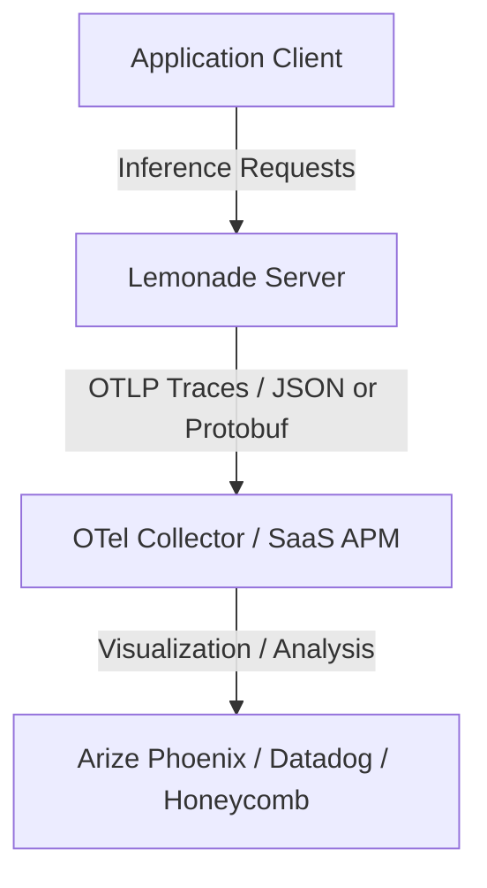

# Telemetry Guide

Lemonade provides a unified, zero-dependency OpenTelemetry (OTLP) telemetry subsystem designed to trace inference requests and export metrics. This allows developers, prompt engineers, and system administrators to monitor token usage, latencies, request context, and scheduler performance.

---

## Architecture & Concepts

Lemonade exports trace spans directly to any OpenTelemetry-compatible collector or application performance monitor (APM) using the OTLP wire protocol.



### Supported Semantic Conventions

Lemonade supports two co-existing trace formats:

1. **OpenInference (`openinference.*`)**:
   - A convention designed specifically for LLM and agentic application tracing.
   - Deeply integrated into AI evaluation suites (e.g., **Arize Phoenix**, **Langfuse**).
   - Captures rich LLM attributes (such as token counts, prompt inputs, completion outputs, and raw thinking blocks).
2. **OpenTelemetry GenAI (`gen_ai.*`)**:
   - The official, vendor-neutral standard defined by the OpenTelemetry community.
   - Supported by mainstream APM backends (e.g., **Honeycomb**, **Datadog**, **Grafana**).
   - Captures standardized attributes (such as system type, request model, and input/output token usage).

You can enable one or both formats. When both are enabled, Lemonade packs attributes for both conventions into a **single pass** and exports them in a **single network payload** to eliminate network overhead.

---

## Integration Guides

### 1. Local LLM Observability with Arize Phoenix

[Arize Phoenix](https://phoenix.arize.com/) is an open-source AI observability platform that runs locally. It allows you to visualize and evaluate your LLM inputs, outputs, latencies, and token counts.

Follow these step-by-step instructions to set up Arize Phoenix and connect it to Lemonade.

#### Step 1: Start Arize Phoenix

You can run Arize Phoenix using either **Docker** or **Podman**. Choose one of the commands below to launch the container in the background (detached mode):

**Using Docker:**
```bash
docker run -d --name phoenix \
  -p 6006:6006 -p 4317:4317 \
  docker.io/arizephoenix/phoenix:latest
```

**Using Podman:**
```bash
podman run -d --name phoenix \
  -p 6006:6006 -p 4317:4317 \
  docker.io/arizephoenix/phoenix:latest
```

> [!NOTE]
> **Understanding Port Mappings:**
> * **Port `6006`**: Serves the Web UI and acts as the OTLP/HTTP traces ingestion endpoint (accepting HTTP protobuf payloads at `/v1/traces`).
> * **Port `4317`**: Used for gRPC OTLP ingestion. This port expects HTTP/2 traffic and will fail with protocol errors if standard HTTP/1.1 requests are sent to it.
> * **Port `4318`**: This is the standard OTel default port for HTTP ingest in other systems, but **Arize Phoenix does not use it**. Ensure your endpoint points to port `6006`.

#### Step 2: Verify Arize Phoenix is Ready

Since the container is launched in the background (detached mode), you must verify that the service is running before testing.

* **Via Browser**: Open your web browser and navigate to [http://localhost:6006](http://localhost:6006). Verify that the Arize Phoenix user interface loads successfully.
* **Via CLI**: Run the following loop in your terminal to block until the `/readyz` readiness endpoint returns success:
  ```bash
  until curl -fsS http://localhost:6006/readyz > /dev/null; do
    sleep 1
  done
  ```

#### Step 3: Configure Lemonade Telemetry

With Arize Phoenix running, configure Lemonade to send traces to the local Phoenix endpoint. You can configure this using the CLI or by modifying your configuration file directly.

##### Option A: Configuration via Lemonade CLI (Recommended)
Run the following command to enable telemetry, set the endpoint, configure the OTLP protocol format, choose the `openinference` semantics, and set an optional project-routing header:
```bash
lemonade config set telemetry.enabled=true \
                    telemetry.otlp.endpoint=http://localhost:6006/v1/traces \
                    telemetry.otlp.protocol=http/protobuf \
                    telemetry.otlp.semantics='["openinference"]' \
                    telemetry.otlp.headers='{"x-project-name":"lemonade"}'
```

##### Option B: Configuration via `config.json`
Alternatively, edit the `telemetry` block in your `config.json` file inside the Lemonade config directory.

> [!IMPORTANT]
> Manually modifying `config.json` requires a restart of the Lemonade server to apply the changes. See the [Configuration Guide](./configuration/README.md#configjson) to find the location of the `config.json` file on your operating system.

```json
{
  "telemetry": {
    "enabled": true,
    "otlp": {
      "endpoint": "http://localhost:6006/v1/traces",
      "protocol": "http/protobuf",
      "semantics": ["openinference"],
      "headers": {
        "x-project-name": "lemonade"
      }
    }
  }
}
```

#### Step 4: Send a Test Request

To verify that telemetry is working correctly, send a test chat completion request to your running Lemonade server:

```bash
curl http://localhost:13305/api/v1/chat/completions \
  -H "Content-Type: application/json" \
  -d '{
    "model": "your-model-name",
    "messages": [
      {"role": "user", "content": "Hello, Lemonade! This is a test request for telemetry."}
    ]
  }'
```

#### Step 5: Flush Traces Immediately (Optional)

To optimize network performance, Lemonade buffers traces in memory and flushes them periodically. If you want to see your test request in the UI immediately without waiting, send a manual flush command:

```bash
curl -X POST http://localhost:13305/internal/telemetry/flush
```

#### Step 6: View Traces in the UI

1. Open your web browser and navigate to: [http://localhost:6006](http://localhost:6006).
2. Click on the **Projects** tab.
3. Select the project name you configured (e.g., `lemonade`).
4. You should see your test request listed with detailed metrics showing prompt tokens, response tokens, latency, and execution parameters.

---

### 2. Cloud Observability (SaaS APM)

If you use a cloud-hosted observability provider (such as Honeycomb, Datadog, or New Relic), you can configure Lemonade to stream trace data directly over HTTPS without running local collectors.

#### Example: Direct-to-Honeycomb

To send trace details to Honeycomb (using `otel_genai` semantics):

```bash
lemonade config set telemetry.enabled=true \
                    telemetry.otlp.endpoint=https://api.honeycomb.io/v1/traces \
                    telemetry.otlp.semantics='["otel_genai"]' \
                    telemetry.otlp.headers='{"x-honeycomb-team": "YOUR_API_KEY"}'
```

---

## Configuration Settings Reference

Telemetry settings are configured under the `telemetry` block in your `config.json` file, or managed dynamically via the Lemonade CLI/API.

| Key | Type | Default | Description |
|-----|------|---------|-------------|
| `telemetry.enabled` | boolean | `false` | Enables or disables telemetry tracing. |
| `telemetry.hide_inputs` | boolean | `false` | Redacts raw prompt inputs from trace attributes to protect user privacy. |
| `telemetry.hide_outputs` | boolean | `false` | Redacts assistant output text from trace attributes. |
| `telemetry.hide_thinking` | boolean | `false` | Redacts internal reasoning/thinking blocks from trace attributes. |
| `telemetry.trust_incoming_trace_context` | boolean | `false` | When `true`, honors caller-supplied W3C `traceparent` headers to link inference spans to the caller's distributed trace. |
| `telemetry.max_queue_capacity` | int | `1000` | Target memory buffer capacity for queued spans. When full, oldest spans are evicted first (FIFO). |
| `telemetry.max_attribute_length` | int | `4096` | Maximum allowed length in bytes for trace span attributes (e.g. prompt text, completion text). Longer attributes are truncated to this limit. |
| `telemetry.otlp.endpoint` | string | `"http://localhost:4318/v1/traces"` | The OTLP HTTP receiver endpoint URL. |
| `telemetry.otlp.protocol` | string | `"http/protobuf"` | The encoding protocol: `"http/protobuf"` or `"http/json"`. |
| `telemetry.otlp.semantics` | array | `["openinference", "otel_genai"]` | Enabled trace conventions. Supported: `"openinference"`, `"otel_genai"`. |
| `telemetry.otlp.headers` | object | `{}` | Custom HTTP headers sent with trace exports (e.g., API keys, project names). |
| `telemetry.otlp.max_retries` | int | `0` | Maximum export retry attempts for transient server errors (0 to disable retries). |
| `telemetry.otlp.retry_backoff_base_s` | double | `5.0` | Base exponential backoff delay in seconds for retries. |
| `telemetry.otlp.send_batch_size` | int | `100` | Target number of spans to dispatch in a single HTTP request batch. |
| `telemetry.otlp.batch_timeout_s` | double | `1.0` | Maximum buffer timeout in seconds before exporting a partial batch. |

---

## Dynamic Control via CLI & API

You can toggle telemetry and modify settings dynamically while the server is running without restarting.

### Via Lemonade CLI

Use the Lemonade CLI configuration commands to update settings on the fly:

```bash
# Enable telemetry
lemonade telemetry on

# Disable telemetry
lemonade telemetry off

# View current configuration
lemonade config

# Configure telemetry options
lemonade config set telemetry.enabled=true
lemonade config set telemetry.otlp.semantics='["openinference"]'
lemonade config set telemetry.otlp.headers='{"x-project-name":"lemonade"}'
```

> [!NOTE]
> When configuring options that require JSON arrays (such as `telemetry.otlp.semantics`) or JSON objects (such as `telemetry.otlp.headers`) via the CLI, wrap the values in single quotes (e.g. `'["openinference"]'`) so your shell does not interpret or expand the bracket `[]` or brace `{}` characters.

### Via Configuration API

You can update the internal configuration by sending a POST request to the `/internal/set` endpoint:

```bash
# Enable telemetry and select only OpenTelemetry GenAI semantics
curl -X POST http://localhost:13305/internal/set \
  -H "Content-Type: application/json" \
  -d '{
    "telemetry": {
      "enabled": true,
      "otlp": {
        "semantics": ["otel_genai"]
      }
    }
  }'
```

### Forcing a Flush

Because spans are buffered in memory to optimize networking, you can force-flush the telemetry queue at any time to export queued traces immediately:

```bash
curl -X POST http://localhost:13305/internal/telemetry/flush
```

---

## Distributed Tracing (W3C Trace Context)

By default, each inference request starts its own root trace. If your calling application is already instrumented (for example, a multi-agent orchestrator or a backend service), you can configure Lemonade to join the caller's trace. This links the entire multi-step workflow into a single trace tree.

To opt in, set `telemetry.trust_incoming_trace_context` to `true`. When enabled, Lemonade looks for a standard [W3C `traceparent`](https://www.w3.org/TR/trace-context/) header on incoming HTTP requests. The inference request span will adopt the trace ID and parent span ID from that header.

If the header is missing, invalid, or the setting is disabled, Lemonade defaults to creating a new root span.

```bash
# Enable distributed tracing via CLI
lemonade config set telemetry.enabled=true \
                    telemetry.trust_incoming_trace_context=true
```

### Example Request with Trace Parent

Here is how an instrumented caller supplies the `traceparent` header to Lemonade:

```bash
curl http://localhost:13305/api/v1/chat/completions \
  -H "Content-Type: application/json" \
  -H "traceparent: 00-4bf92f3577b34da6a3ce929d0e0e4736-00f067aa0ba902b7-01" \
  -d '{
    "model": "your-model-name",
    "messages": [
      {"role": "user", "content": "Hello, Lemonade!"}
    ]
  }'
```

> [!WARNING]
> Only enable `telemetry.trust_incoming_trace_context` if you trust the callers on your network. Enabling this setting allows client-supplied headers to modify the structure of your trace parentage.

---

## Privacy & Redaction

By default, Lemonade captures prompts, completions, and internal reasoning/thinking steps in trace span attributes to allow full evaluation and debugging.

If you are running in a privacy-sensitive or production environment, you can redact these textual payloads from outgoing telemetry data:

```bash
# Redact inputs, outputs, and thinking steps
lemonade config set telemetry.hide_inputs=true \
                    telemetry.hide_outputs=true \
                    telemetry.hide_thinking=true
```

When redacted, metadata such as token counts, latency, model names, and HTTP status codes are still exported, but the actual text content is replaced with `[REDACTED]` values.
